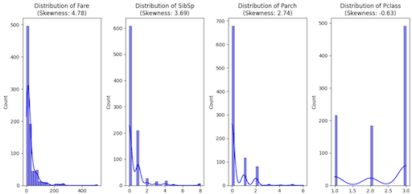
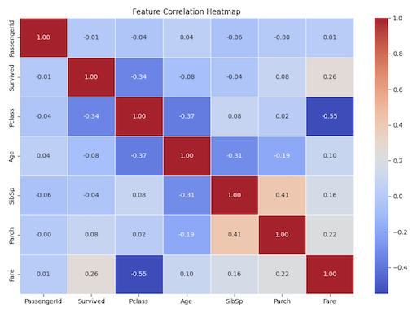

# Simple Data Visualization in Python Using a Public Dataset
A Jupyter Notebook to perform Data Visualization, including initial data exploration, Skewness, Kurtosis, and Correlation analysis for typical dataset.


## Usage
Open the notebook and run the cells step by step:

- Data loading(Input your data path and N rows)
- Initial Exploration
- Skewness & Kurtosis analysis
- Correlation analysis with heatmaps
- More Visualization

Example Output:
- Skewness & Kurtosis analysis


- Correlation Heatmap


- **📝 Notes:**: The dataset used in this notebook is the **Titanic dataset** from Kaggle (`train.csv`).


## Concept
[Visit (takehika0129.github.io)](https://takehika0129.github.io/takehika-github-pages/reviews/prototype10.html)


## Requirements
- Python 3.x
- `pandas`
- `numpy`
- `scipy`
- `matplotlib`
- `seaborn`

Install dependencies:
```sh
pip install -r requirements.txt
```

## License
You are free to use this code for personal and educational purposes. Commercial use and redistribution are not allowed.